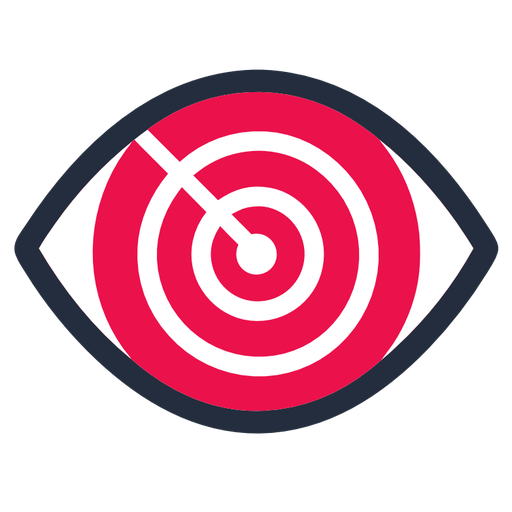
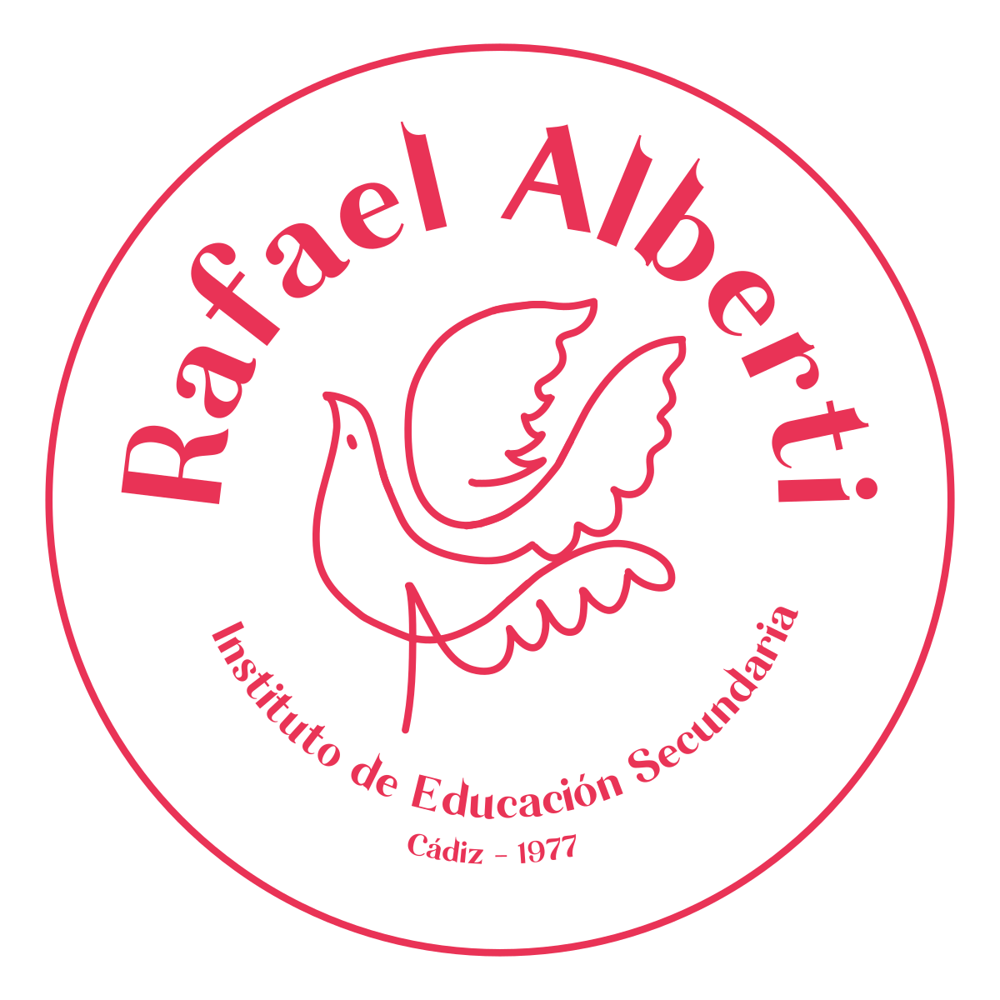
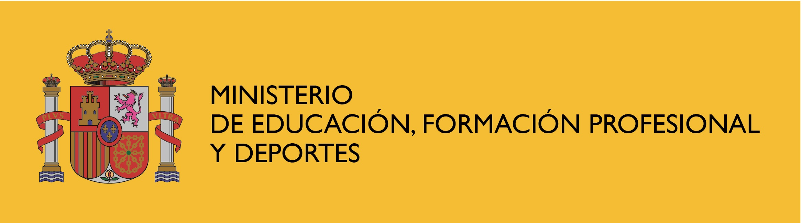
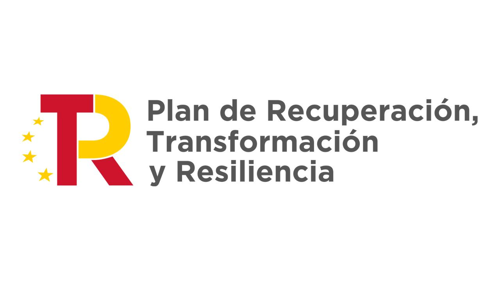
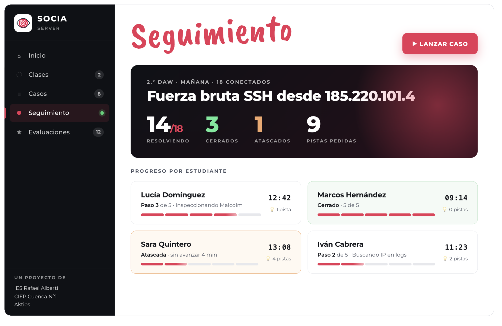
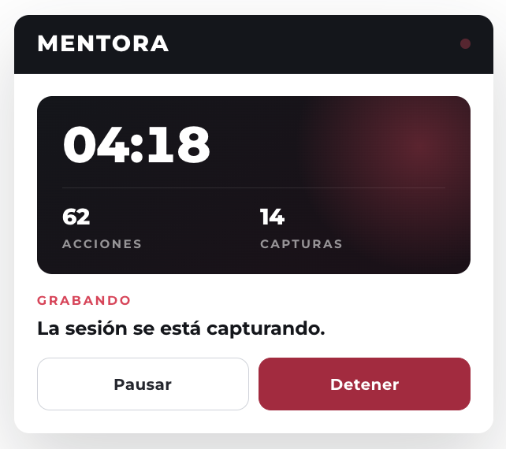
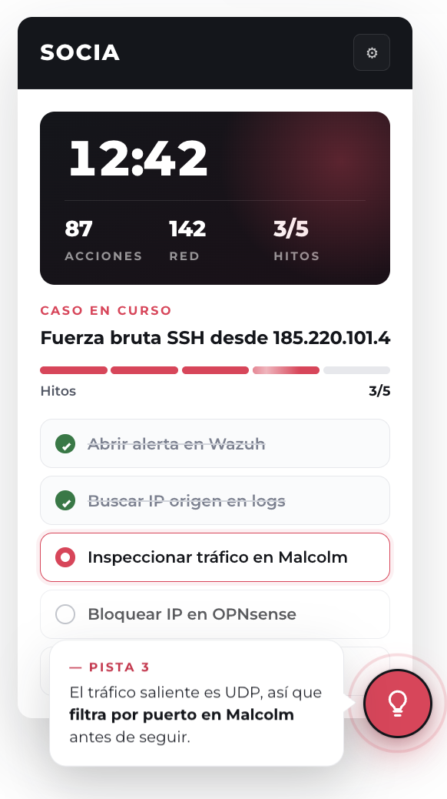
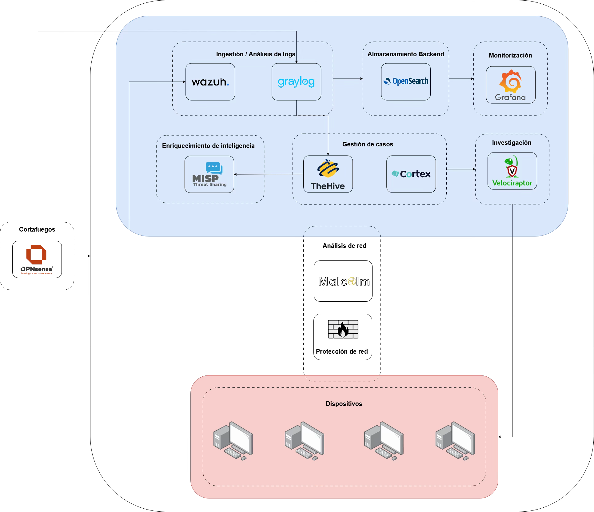

<!-- .slide: data-background-color="#FFFFFF" -->

<h1 style="font-size: 2.8em; margin-bottom: 0.1em;">SOCIA</h1>

<h3 style="text-transform: none; font-weight: 400;">Plataforma para el entrenamiento de gestión de incidentes de ciberseguridad tutorizada con Inteligencia Artificial</h3>

<strong>AINN23 / 00303</strong> · Proyecto de Innovación 
Jornadas Formativas · Cádiz · 21 – 22 de mayo de 2026

---

# ¿Qué es SOCIA?

Note:
SOCIA = SOC + IA. El acrónimo lo dice todo: un Centro de Operaciones de Seguridad con una capa de IA encima.

- Una **plataforma** para entrenar la **gestión de incidentes** de ciberseguridad en el aula.
- Un **SOC real** tutorizado por **Inteligencia Artificial**.
- Pensada, inicialmente, para el módulo de **Incidentes de Ciberseguridad** del CE en Ciberseguridad.

---

## ¿Y más allá del CE de Ciberseguridad?

<h4>CFGS ASIR</h4>

<h4>CFGM SMR</h4>

<h4>Bachillerato / ESO TIC</h4>

Note:
La arquitectura de SOCIA y los escenarios permiten adaptar el nivel a otras enseñanzas. La idea es que el centro elija el nivel de profundidad, no que el alumnado tenga que llegar al nivel del CE. Misma plataforma, distintos niveles de profundidad según la enseñanza.

- **CFGS ASIR** — Módulo *Seguridad y Alta Disponibilidad*: detección, análisis de logs, hardening, monitorización.
- **CFGM SMR** — Módulo *Seguridad Informática*: modo guiado y divulgativo, rol de analista SOC.
- **Bachillerato / ESO TIC** — Demostraciones puntuales: acercar la ciberseguridad y los perfiles SOC al alumnado.

---

## Marco del proyecto

Proyectos de Innovación e Investigación aplicadas y transferencia del conocimiento en FP

**Convocatoria**: 2023

**Desarrollo del proyecto**: sept. 2024 – ago. 2026

---

## Tres equipos, un proyecto

<!-- 
<strong>Centro coordinador</strong>
 -->

<!-- 
<strong>Centro participante</strong>
 -->

<!-- 
<strong>Empresa colaboradora</strong>
 -->

Note:

SOCIA es un trabajo a tres bandas entre dos centros públicos de Formación Profesional y una empresa especializada en ciberseguridad. Cada uno aporta una pieza imprescindible: didáctica, alcance y experiencia profesional.

- **IES Rafael Alberti** (Cádiz) — Centro coordinador. Coordinación pedagógica, diseño didáctico, despliegue piloto y documentación.
- **CIFP Nº1 de Cuenca** — Centro participante. Validación en un segundo entorno educativo y co-creación de casos de uso.
- **AKTIOS Security Services** — Empresa colaboradora. Aporta el conocimiento operativo de SOC real.

---

# El problema que queríamos resolver

Note:

- El módulo de **Incidentes de Ciberseguridad** exige práctica realista

- El alumnado necesita **incidentes que ocurran**, no incidentes contados en una pizarra

- No hay un entorno SOC **profesional, libre y replicable** que pueda llevarse directamente al aula

---

# Un SOC real, no un simulador.

Note:
Por eso nace socia...

---

01

Detecta

→

02

Investiga

→

03

Contiene

04

Responde

→

05

Documenta

Note:
- El alumnado **se sienta delante de su SOC**.
- La plataforma **lanza un incidente** (ataque simulado / replay / escenario IA).
- El alumno recorre el ciclo: **detecta → investiga → contiene → responde → documenta**.
- Esto es lo que diferencia a SOCIA de una práctica tradicional: el incidente ocurre de verdad sobre la infraestructura, y la evaluación no depende solo del criterio del docente.

---

## Arquitectura de la plataforma

Panel docente — clases, casos, dashboards en directo, evaluaciones

▼

Capa de Inteligencia Artificial — generación y tutorización de incidentes <em>(se explicará al día siguiente)</em>

▼

Infraestructura SOC

▼

Red simulada · endpoints · servicios objetivo

Note:
Cuatro capas:
1. Infra base — la "red" donde ocurren las cosas.
2. Stack SOC profesional — todo software libre.
3. Capa de IA — el cerebro que decide qué pasa, evalúa al alumno y guía.
4. Capa pedagógica — lo que ve el docente y el alumno.

La capa de IA es la que justifica el nombre y la que veremos en profundidad mañana.

---

## Panel docente

---

# Un panel, dos extensiones

---

## Mentora

Note:
Extensión de navegador que graba al docente resolviendo un caso (pantalla, voz y acciones). Genera una guía PDF y un caso en json listo para SOCIA.

---

## La segunda extensión, la capa de IA

La parte que da nombre al proyecto: la **IA** de SOCIA

Note:
Extensión de navegador que carga el caso, realiza el seguimiento, ofrece pistas con un LLM pequeño y genera una evaluación final en PDF. Funciona con o sin servidor.

---

## SOCIA

Note:

**Tutoriza** al alumno: pistas, refuerzos, escalado de dificultad

**Evalúa** la resolución comparando con el ground truth del escenario

---

## Arquitectura del SOC

Note:
Cuatro capas:
1. Infra base — la "red" donde ocurren las cosas.
2. Stack SOC profesional — todo software libre.
3. Capa de IA — el cerebro que decide qué pasa, evalúa al alumno y guía.
4. Capa pedagógica — lo que ve el docente y el alumno.

La capa de IA es la que justifica el nombre y la que veremos en profundidad mañana.

---

## Stack de herramientas

<h4>OPNsense</h4>
Cortafuegos perimetral con IDS / IPS.

<h4>Wazuh</h4>
SIEM central · correlación de eventos y detección de amenazas.

<h4>OpenSearch</h4>
Almacenamiento y búsqueda de eventos del SIEM.

<h4>TheHive</h4>
Gestión profesional de casos de incidentes · triaje y seguimiento.

<h4>Cortex</h4>
Motor de análisis automatizado de observables e IOCs.

<h4>MISP</h4>
Plataforma de intercambio de inteligencia de amenazas.

<h4>Velociraptor</h4>
Forense de endpoint y recolección de evidencias.

<h4>Malcolm</h4>
Análisis forense de tráfico de red a partir de PCAP.

<h4>T-Pot</h4>
Honeypots para inteligencia de amenazas.

Note:
Todas estas herramientas se van a explicar a lo largo de las jornadas, y luego se propondrán casos de uso concretos para llevar al aula.

<!-- ---

## Las herramientas, una a una

A lo largo de estas jornadas vamos a **explicar cada herramienta** del stack y **proponer casos de uso** concretos para el aula.

Después, aterrizaremos sobre escenarios reales del módulo. -->

---

# Extensible a cualquier centro

Note:

- SOCIA no es un servicio cerrado: es una <strong>arquitectura desplegable</strong> que cualquier centro educativo puede instalar en su propia infraestructura.

- Stack 100% **software libre**

- Documentación de despliegue **paso a paso**

- Casos de uso **reutilizables** y adaptables

---

# Comunidad

Note:

Queremos que SOCIA **viva más allá del proyecto**

Otros centros que lo desplieguen → **nuevos casos de uso**

Profesorado que adapte → **nuevos escenarios**

Empresas que colaboren → **incidentes basados en la realidad del sector**

---

<!-- ## Beneficiarnos de las mejoras -->

Cada centro que adopte SOCIA es un <strong>nodo activo</strong>: comparte sus escenarios, sus mejoras y su experiencia con el resto de la red.

Note:

Mejoras al núcleo → todos las recibimos.

Catálogo compartido de incidentes → crece con el tiempo.

Buenas prácticas docentes → documentadas y replicables.

---

## Tu propio SOC

<!-- 

El <strong>viernes a las 13:30</strong> abriremos el repositorio completo y veremos cómo poner en marcha un SOC con SOCIA.

 -->

«Acceso al repositorio y puesta en marcha»

---

<!-- .slide: data-background-color="#1E283C" class="has-dark-background" -->

## ☕ Desayuno

### Formulario por parejas

Antes de pasar al desayuno, escanea el **QR** y completa el formulario por parejas.

---

## ¿Preguntas?

Proyecto SOCIA · AINN23 / 00303 · IES Rafael Alberti · CIFP Nº1 Cuenca · AKTIOS

